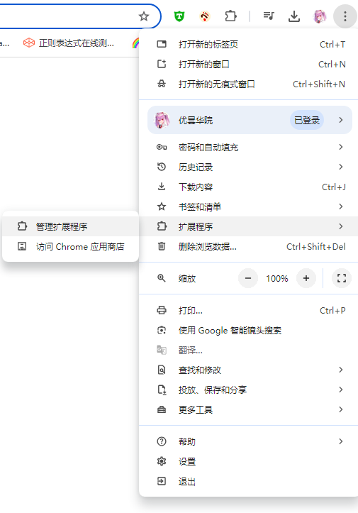
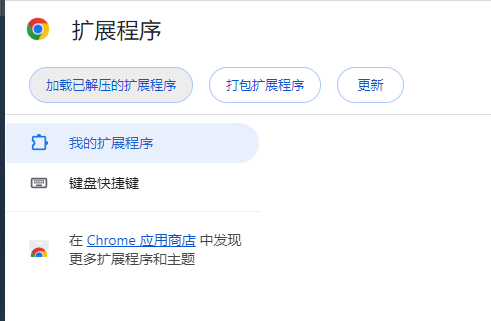
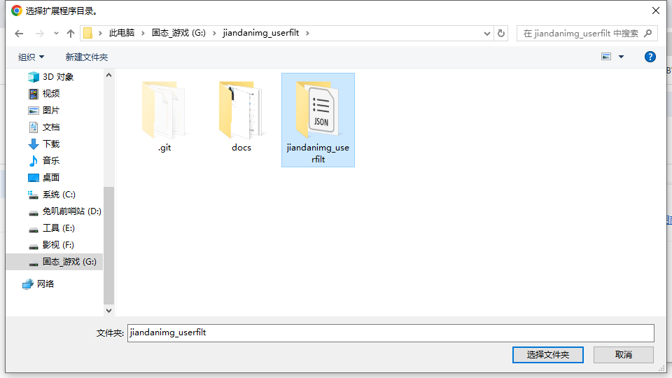
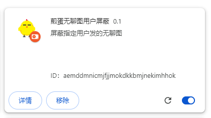
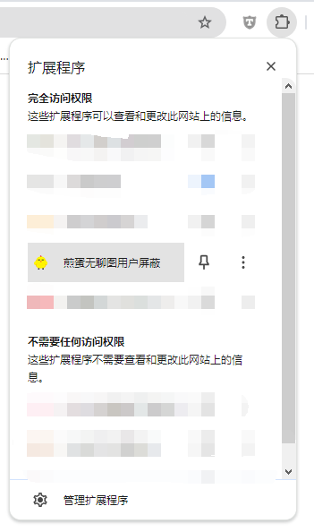
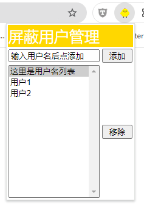
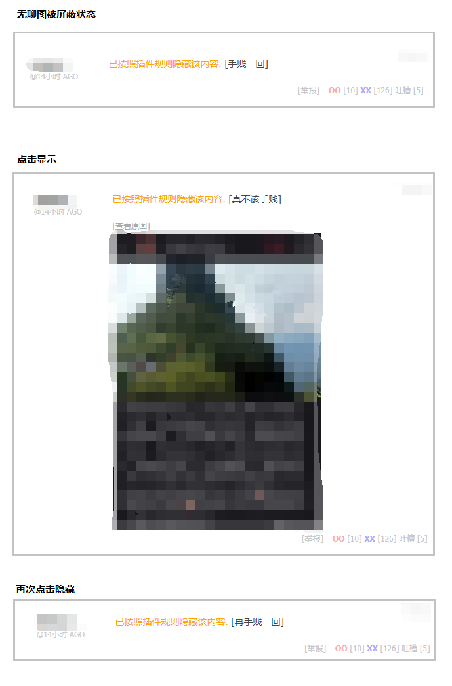

     

# 煎蛋无聊图用户屏蔽

      

    此为chrome插件，可在煎蛋网无聊图页面屏蔽指定用户发的图
    随手拍页面也能生效

## 下载
[下载页面](https://github.com/MikuNyanya/jiandanimg_userfilt/releases/tag/v1.0)

## 使用演示     
**1.插件安装**

    下载完后解压，可以得到一个文件夹，在chrome中安装它        
    在chrome浏览器的菜单中 `扩展程序` —> `管理扩展程序`       
 

    然后点击 `加载已解压的扩展程序` 使用文件夹的形式安装插件      
 
 

    安装完成后，应当可以在插件列表中看到本插件了
    chrome的插件栏中也能找到对应图标
 
 

---
**2.插件使用**      
        

    从chrome的插件栏中点开插件的窗口，把用户名称添加进屏蔽列表        
 

    插件效果逻辑和煎蛋网本身自带的 `隐藏不受欢迎图片` 功能相似
    效果如下
 

___
    在本项目开发过程中，没有任何兔子受到伤害
__联系兔子：q群(857489126)__